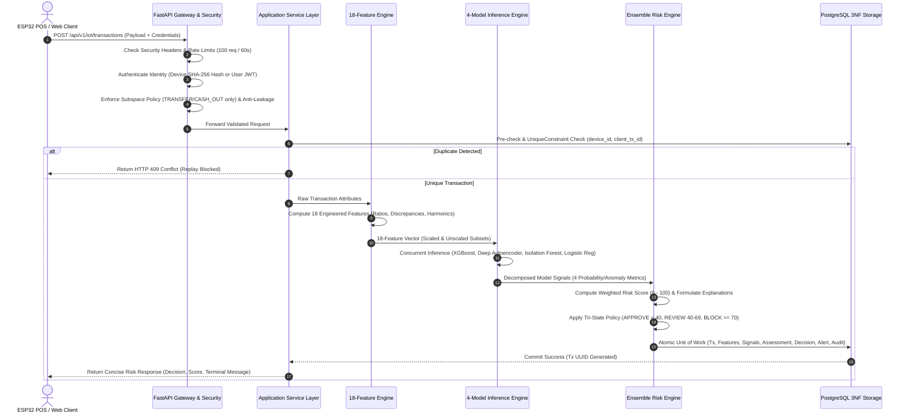
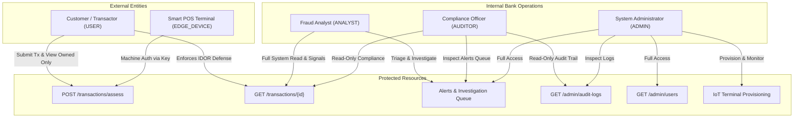
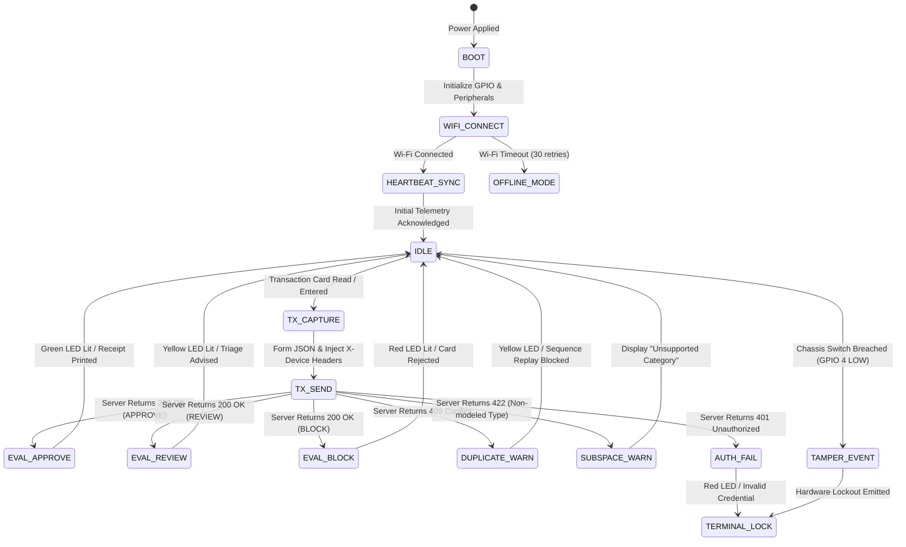

# A.R.G.U.S. — Complete System Workflow & User Role Views
## Comprehensive Operational Blueprint, Access Level Architecture & Interface Specifications

### Academic Technical Documentation — Project A.R.G.U.S.
**Academic Year:** 2026–27 (Odd Semester)  
**Programme / Class:** B.Tech AIML – C  
**Project:** A.R.G.U.S. (Automated Risk Assessment & Anomaly Detection System)  
**Subtitle:** AI-Based Real-Time Fraud Detection and Transaction Risk Monitoring System  
**Mentor / Guide:** Prof. Sunil Kale  
**Student Team:** Savar Shetty, Pranav Pawar, Siddhesh Gire, Devraj Misal, Atharva Morbale  

---

## 1. Executive Summary & Prototype Mission

### 1.1 The Operational Challenge
Modern digital banking rails, mobile payment platforms, and edge Point-of-Sale (POS) networks process millions of financial movements daily. Within these massive data streams, fraudulent behavior represents an extreme minority—empirically established at approximately **0.129%** in the standardized PaySim benchmark dataset.

Detecting fraudulent transfers without disrupting legitimate commercial velocity requires a system that achieves:
1. **Sub-second latency**: Processing transaction ingress, feature extraction, multi-model evaluation, and risk decisioning in real time.
2. **High sensitivity to synthetic and emerging fraud**: Detecting both deterministic liquidation patterns (large drains with destination zero-balance anomalies) and novel spatial outliers.
3. **Defense-in-depth security**: Protecting against credential compromise, Insecure Direct Object References (IDOR), replay attacks, and denial of service.
4. **Multi-persona visibility**: Serving transacting customers, fraud analysts, system administrators, compliance auditors, and edge IoT devices with distinct, strictly isolated operational views.

### 1.2 System Blueprint
Project **A.R.G.U.S.** realizes this vision through an end-to-end multi-tier architecture uniting edge IoT ingestion, application security, machine learning/deep learning ensembles, and relational database management:

```
[ Edge ESP32 POS Terminals ]       [ Web Clients / Transactors ]
              │                                  │
              │ (X-Device Headers)               │ (Bearer JWT)
              ▼                                  ▼
      +──────────────────────────────────────────────────+
      │      A.R.G.U.S. FastAPI Gateway & Security       │
      │  - Security Headers & Sliding-Window Rate Limit  │
      │  - Cryptographic Device Auth & JWT Verification  │
      │  - RBAC & Object-Level Authorization (IDOR)      │
      │  - Anti-Leakage & Modeling Subspace Validation   │
      +──────────────────────────────────────────────────+
                               │
                               ▼
      +──────────────────────────────────────────────────+
      │      18-Feature Real-Time Engineering Pipeline   │
      │  - Origin balance discrepancies & drain ratios   │
      │  - Destination zero-balance anomalies            │
      │  - Temporal cyclical harmonic encodings (sin/cos)│
      +──────────────────────────────────────────────────+
                               │
                               ▼
      +──────────────────────────────────────────────────+
      │       Multi-Model AI/ML Inference Engine         │
      │  - Supervised XGBoost (Tree Classifier, 50%)     │
      │  - Deep Autoencoder (PyTorch MSE Loss, 20%)      │
      │  - Unsupervised Isolation Forest (Outlier, 15%)  │
      │  - Logistic Regression (Linear Baseline, 15%)    │
      +──────────────────────────────────────────────────+
                               │
                               ▼
      +──────────────────────────────────────────────────+
      │          Ensemble Multi-Signal Risk Engine       │
      │  - Continuous Risk Score Calculation (0 - 100)   │
      │  - Tri-State Decision: APPROVE / REVIEW / BLOCK  │
      │  - Automated Natural Language Explanations       │
      +──────────────────────────────────────────────────+
                               │
                               ▼
      +──────────────────────────────────────────────────+
      │       PostgreSQL 3NF Relational Persistence      │
      │  - Transactions & Features                       │
      │  - Model Signals & Decision Records              │
      │  - Automatic Analyst Alert Generation            │
      │  - Immutable Security & Hardware Audit Trails    │
      +──────────────────────────────────────────────────+
```

---

## 2. Complete End-to-End System Workflow

The lifecycle of an operational transaction through Project A.R.G.U.S. proceeds across ten deterministic stages:



### Stage 1: Ingress Channel Differentiation
Transactions originate either from **Human Transactors** via web/mobile banking clients or from **Physical Edge POS Terminals** (ESP32 microcontrollers). Human callers transmit stateless Bearer JWTs; edge devices transmit hardware headers (`X-Device-Code`, `X-Device-API-Key`).

### Stage 2: Defensive Edge Filtering
Before routing into application code, incoming requests traverse `SecurityHeadersMiddleware` (injecting `nosniff`, `DENY`, and CSP directives) and `RateLimitMiddleware` (enforcing a sliding-window quota of 100 requests per 60 seconds per client IP). Requests breaching limits immediately receive `HTTP 429 Too Many Requests`.

### Stage 3: Cryptographic Identity & Authorization
- **Machine Callers**: The device code is looked up in the `devices` table, the presented API key is hashed with SHA-256, and compared against `device.api_key_hash` using constant-time `secrets.compare_digest()`. If inactive or flagged as tampered, access is blocked with `HTTP 403 Forbidden`.
- **Human Callers**: The JWT signature and expiration are verified using HS256, active user status is validated, and the caller's operational role is verified.

### Stage 4: Modeling Subspace & Anti-Leakage Validation
- **Anti-Leakage Guard**: PaySim evaluation labels (`isFraud`, `isFlaggedFraud`) are strictly forbidden in ingress payloads. Any request containing these fields is rejected with `HTTP 422 Unprocessable Entity`.
- **Strict Modeling Subspace**: PaySim fraud patterns are exclusively present in `TRANSFER` and `CASH_OUT` categories. Inbound requests with types `PAYMENT`, `CASH_IN`, or `DEBIT` return a controlled `HTTP 422` informing the client that these transaction types are not currently evaluated by the ML risk model.

### Stage 5: Concurrency-Safe Replay Protection
The terminal's client sequence identifier (`client_tx_id`) is evaluated against existing records for that `device_id`. The database catalog constraint `UniqueConstraint("device_id", "client_tx_id")` ensures that duplicate submissions (due to edge network drops or malicious replay attacks) are halted with `HTTP 409 Conflict`.

### Stage 6: Real-Time 18-Feature Extraction
The raw attributes (`amount`, balances, timestamp step) are transformed into the validated 18-feature vector:
1. `amount`: Raw monetary magnitude.
2. `oldbalance_org`: Origin pre-transaction ledger balance.
3. `newbalance_orig`: Origin post-transaction ledger balance.
4. `oldbalance_dest`: Destination pre-transaction ledger balance.
5. `newbalance_dest`: Destination post-transaction ledger balance.
6. `log_amount`: Natural logarithmic scaling $\ln(\text{amount} + 1)$.
7. `is_transfer`: Binary indicator for TRANSFER.
8. `is_cash_out`: Binary indicator for CASH_OUT.
9. `hour_of_day`: Modulo simulation hour ($\text{step} \pmod{24}$).
10. `hour_sin`: Cyclical diurnal sine harmonic $\sin(2\pi \cdot \text{hour} / 24)$.
11. `hour_cos`: Cyclical diurnal cosine harmonic $\cos(2\pi \cdot \text{hour} / 24)$.
12. `is_night_transaction`: Indicator for high-risk nocturnal window (hours 0–6).
13. `orig_balance_error`: Arithmetic discrepancy $(\text{newbalance\_orig} + \text{amount} - \text{oldbalance\_org})$.
14. `orig_drain_ratio`: Proportion of origin balance drained $\text{amount} / (\text{oldbalance\_org} + 1)$.
15. `is_full_liquidation`: Binary indicator if account is completely emptied.
16. `dest_balance_error`: Beneficiary ledger discrepancy.
17. `dest_drain_ratio`: Beneficiary movement ratio.
18. `dest_zero_balance_anomaly`: Binary flag for mule accounts where destination balance remains zero despite inbound transfer.

### Stage 7: Multi-Model Inference Execution
The feature matrix is dispatched to the preloaded `ModelManager`:
- **Supervised XGBoost**: Evaluates non-linear feature interactions on unscaled inputs $\rightarrow$ outputs supervised probability $P_{\text{XGB}}$.
- **Supervised Logistic Regression**: Evaluates standardized linear baselines $\rightarrow$ outputs calibrated probability $P_{\text{LR}}$.
- **Unsupervised Isolation Forest**: Computes tree path length spatial isolation on unscaled features $\rightarrow$ outputs normalized anomaly score $A_{\text{IF}} \in [0, 1]$.
- **Unsupervised Deep Autoencoder**: Executes forward pass through 4-layer PyTorch encoder-decoder, calculating Mean Squared Error (MSE) feature reconstruction loss normalized against the 99th percentile validation threshold $\rightarrow$ outputs normalized anomaly score $A_{\text{AE}} \in [0, 1]$.

### Stage 8: Ensemble Risk Scoring Engine
The continuous 0–100 Multi-Model Risk Score is aggregated using the validated empirical weights:
$$\text{Risk Score} = 100 \times \left( 0.50 \cdot P_{\text{XGB}} + 0.20 \cdot A_{\text{AE}} + 0.15 \cdot A_{\text{IF}} + 0.15 \cdot P_{\text{LR}} \right)$$
Simultaneously, the engine evaluates feature anomalies to generate human-readable natural language diagnostic explanations (e.g., *"Mule recipient anomaly detected"*, *"Origin balance error of $399,045.08 detected"*).

### Stage 9: Tri-State Operational Decision Policy
The continuous score maps directly to the operational policy:
- **`APPROVE` ($\text{Score} < 40.0$)**: Legitimate transaction; executes immediately.
- **`REVIEW` ($40.0 \le \text{Score} < 70.0$)**: Moderate risk or ambiguous anomaly; transaction is held for human triage, and a `HIGH` severity alert is dispatched.
- **`BLOCK` ($\text{Score} \ge 70.0$)**: Critical fraud probability; transaction is declined, and a `CRITICAL` severity alert is logged.

### Stage 10: Atomic Relational Persistence & Edge Actuation
In a single atomic transaction, the repository persists:
1. `transactions` table record with foreign keys to `device_id` and `merchant_id`.
2. Exact 18 engineered features in `transaction_features`.
3. Decomposed outputs in `model_results` (4 rows per transaction).
4. `risk_assessments` record storing final score and engine metadata.
5. `decisions` record storing tri-state verdict and explanation strings.
6. `alerts` queue entry if decision is `REVIEW` or `BLOCK`.
7. Structured event in `audit_logs`.

A concise response contract (`IoTRiskResponse`) is returned to the caller. Edge ESP32 terminals parse this response to illuminate local LEDs and display text verdicts on terminal screens.

---

## 3. Access Level Architecture & Permissions Matrix

A.R.G.U.S. enforces access boundaries separating external transactors, operational fraud analysts, compliance auditors, administrators, and automated terminals:



### Comprehensive Permissions Matrix

| Functional Capability | `USER` | `ANALYST` | `ADMIN` | `AUDITOR` | `EDGE_DEVICE` |
| :--- | :---: | :---: | :---: | :---: | :---: |
| **Submit Web/Mobile Transaction** | ✅ | ✅ | ✅ | ❌ | ❌ |
| **Submit Edge Terminal Transaction** | ❌ | ❌ | ❌ | ❌ | ✅ (Via API Key) |
| **View Personally Owned Transactions** | ✅ | ✅ | ✅ | ✅ | ❌ |
| **Inspect Any User's Transaction** | ❌ (403 IDOR) | ✅ | ✅ | ✅ | ❌ |
| **Inspect Decomposed ML Model Signals** | ❌ | ✅ | ✅ | ✅ | ❌ |
| **Query Pending Alerts Queue** | ❌ | ✅ | ✅ | ✅ | ❌ |
| **Resolve / Dismiss Analyst Alerts** | ❌ | ✅ | ✅ | ❌ | ❌ |
| **Synchronize Telemetry (Heartbeat)** | ❌ | ❌ | ❌ | ❌ | ✅ |
| **Inspect Security Audit Trail (`audit_logs`)** | ❌ (403) | ❌ (403) | ✅ | ✅ | ❌ |
| **Provision / Decommission Edge Terminals** | ❌ | ❌ | ✅ | ❌ | ❌ |
| **User Management & Role Assignment** | ❌ | ❌ | ✅ | ❌ | ❌ |
| **Inspect System Rate Limiting Health** | ❌ | ❌ | ✅ | ❌ | ❌ |

---

## 4. User View 1: Customer / Transactor View (`USER`)

### 4.1 Persona & Objectives
The standard **Transactor** represents retail banking customers or e-commerce buyers. Their objective is to execute transfers frictionlessly while receiving transparent status updates when anomalous activity occurs.

### 4.2 Customer Portal Wireframe

```
+─────────────────────────────────────────────────────────────────────────────+
|  A.R.G.U.S. SECURE BANKING PORTAL                 [ Welcome, Savar Shetty ] |
+─────────────────────────────────────────────────────────────────────────────+
|                                                                             |
|  [ New Transfer ]     [ Transaction History ]     [ Security Settings ]     |
|                                                                             |
|  INITIATE INSTANT TRANSFER                                                  |
|  ┌───────────────────────────────────────────────────────────────────────┐  |
|  │ Destination Account:  [ M9876543210 (Apex Tech Store)               ] │  |
|  │ Transfer Category:    (•) TRANSFER    ( ) CASH_OUT                    │  |
|  │ Monetary Amount ($):  [ 250.00                                      ] │  |
|  │ Notes / Memo:         [ Payment for hardware components             ] │  |
|  │                                                                       │  |
|  │ [ SUBMIT TRANSACTION FOR INSTANT ASSESSMENT ]                         │  |
|  └───────────────────────────────────────────────────────────────────────┘  |
|                                                                             |
|  RECENT ACCOUNT MOVEMENTS                                                   |
|  ┌────────────┬──────────┬─────────────┬───────────┬──────────────────────┐ │
|  │ Date / UTC │ Type     │ Amount      │ Status    │ Action / Details     │ │
|  ├────────────┼──────────┼─────────────┼───────────┼──────────────────────┤ │
|  │ 23:45:10   │ TRANSFER │ $    250.00 │ APPROVED  │ [ View Receipt ]     │ │
|  │ 22:15:04   │ TRANSFER │ $  1,200.00 │ APPROVED  │ [ View Receipt ]     │ │
|  │ 18:30:12   │ CASH_OUT │ $ 15,000.00 │ IN REVIEW │ [ Contact Support ]  │ │
|  │ 14:02:55   │ TRANSFER │ $399,045.08 │ DECLINED  │ [ Security Notice ]  │ │
|  └────────────┴──────────┴─────────────┴───────────┴──────────────────────┘ │
|                                                                             |
|  * Notice: Transactions flagged as IN REVIEW are verified within 15 minutes.│
+─────────────────────────────────────────────────────────────────────────────+
```

### 4.3 Insecure Direct Object Reference (IDOR) Defense Demonstration
When customer `Savar Shetty` views their receipt for transaction `edda09c0-61b7-40ce-b049-3ebc85012ab6`, the portal calls `GET /api/v1/transactions/edda09c0-...`.

If Savar modifies the URL to query another customer's transaction (`555d236a-8979-466d-9913-ae678db79ed4`), the backend executes `TransactionService.get_authorized_transaction()`:
1. Validates that `transaction.user_id` belongs to `analyst_bob`.
2. Identifies that Savar has role `USER` and `user_id != tx.user_id`.
3. Intercepts access and immediately emits `HTTP 403 Forbidden`:
   ```json
   {
     "detail": "Forbidden: You do not have permission to access another user's transaction record."
   }
   ```
4. Records an immutable security audit event: `SECURITY_ACCESS_DENIED`.

---

## 5. User View 2: Fraud Operations Analyst View (`ANALYST`)

### 5.1 Persona & Objectives
The **Fraud Operations Analyst** is responsible for operational risk monitoring, reviewing transactions flagged as `REVIEW` (scores 40–69) or `BLOCK` (scores $\ge 70$), analyzing multi-model signal breakdowns, and clearing or escalating security alerts.

### 5.2 Analyst Investigation Console Wireframe

```
+─────────────────────────────────────────────────────────────────────────────+
|  A.R.G.U.S. FRAUD SURVEILLANCE & TRIAGE CONSOLE     [ Analyst: Pranav Pawar ]|
+─────────────────────────────────────────────────────────────────────────────+
|  LIVE METRICS: [ Ingress: 42 tx/sec ] [ Flagged: 1.4% ] [ Auto-Block: 0.3% ] |
+─────────────────────────────────────────────────────────────────────────────+
|  PENDING INVESTIGATION QUEUE (REVIEW & BLOCK VERDICTS)                      |
|  ┌──────┬──────────┬─────────────┬───────┬──────────┬─────────────────────┐ │
|  │ Time │ Type     │ Amount      │ Score │ Decision │ Actions             │ │
|  ├──────┼──────────┼─────────────┼───────┼──────────┼─────────────────────┤ │
|  │ 00:12│ CASH_OUT │ $399,045.08 │ 86.41 │ BLOCK    │ [ INSPECT SIGNALS ] │ │
|  │ 00:11│ TRANSFER │ $ 45,000.00 │ 54.20 │ REVIEW   │ [ INSPECT SIGNALS ] │ │
|  │ 00:09│ CASH_OUT │ $ 12,500.00 │ 48.10 │ REVIEW   │ [ INSPECT SIGNALS ] │ │
|  └──────┴──────────┴─────────────┴───────┴──────────┴─────────────────────┘ │
|                                                                             |
|  DETAILED INCIDENT INSPECTION — TRANSACTION #555d236a-8979                  |
|  Origin: C1039904508  ──[ CASH_OUT: $399,045.08 ]──>  Beneficiary: M0000000001|
|                                                                             |
|  MULTI-MODEL DECOMPOSED SIGNALS:                                            |
|  ┌───────────────────────┬─────────────┬───────────┬──────────────────────┐ │
|  │ Model Architecture    │ Raw Metric  │ Norm Score│ Ensemble Contribution│ │
|  ├───────────────────────┼─────────────┼───────────┼──────────────────────┤ │
|  │ Supervised XGBoost    │ Prob: 0.7654│ 76.54%    │ 38.27 pts (wt: 0.50) │ │
|  │ Deep Autoencoder (DL) │ MSE:  0.0842│ 100.00%   │ 20.00 pts (wt: 0.20) │ │
|  │ Isolation Forest      │ Path: -0.182│ 87.60%    │ 13.14 pts (wt: 0.15) │ │
|  │ Logistic Regression   │ Prob: 1.0000│ 100.00%   │ 15.00 pts (wt: 0.15) │ │
|  ├───────────────────────┴─────────────┴───────────┼──────────────────────┤ │
|  │ FINAL AGGREGATED CONTINUOUS RISK SCORE          │ 86.41 / 100.0        │ │
|  │ OPERATIONAL TRI-STATE POLICY ACTION             │ BLOCK (MANDATORY)    │ │
|  └─────────────────────────────────────────────────┴──────────────────────┘ │
|                                                                             |
|  NATURAL LANGUAGE EXPLANATION BREAKDOWN (REASON CODES):                     |
|  • High supervised fraud probability detected by XGBoost classifier (76.54%).│
|  • Critical feature reconstruction anomaly flagged by Deep Autoencoder.     │
|  • Destination account zero-balance anomaly: Mule account receiving funds.  │
|  • Origin ledger discrepancy detected: Balance error of $399,045.08.        │
|  • Large monetary magnitude ($399,045.08) exceeding baseline profile.       │
|                                                                             |
|  TRIAGE CONTROLS:  [ CONFIRM FRAUD & FREEZE ]   [ ESCALATE ]   [ OVERRIDE ] │
+─────────────────────────────────────────────────────────────────────────────+
```

### 5.3 Forensic Multi-Model Signal Interpretation
The Analyst View provides transparency into why a transaction was flagged:
- **XGBoost (Supervised)** captures correlated non-linear patterns learned from historical fraud vectors.
- **Deep Autoencoder (Unsupervised DL)** identifies that the combination of features violates the reconstruction manifold learned from benign baseline transactions.
- **Isolation Forest (Unsupervised ML)** confirms that the transaction is isolated in sparse feature space.
- **Logistic Regression (Linear)** establishes the baseline mathematical risk.

---

## 6. User View 3: System Administrator View (`ADMIN`)

### 6.1 Persona & Objectives
The **System Administrator** manages infrastructure health, provisions edge POS devices, manages user roles, monitors sliding-window rate limits, and reviews administrative audit trails.

### 6.2 Administrator Operations Dashboard Wireframe

```
+─────────────────────────────────────────────────────────────────────────────+
|  A.R.G.U.S. SYSTEM ADMINISTRATION & EDGE GATEWAY     [ Admin: Siddhesh Gire ]|
+─────────────────────────────────────────────────────────────────────────────+
|  INFRASTRUCTURE STATUS: [ Gateway: ONLINE ] [ DB: 3NF CONNECTED ] [ Models: 4/4 LOADED ]
+─────────────────────────────────────────────────────────────────────────────+
|  EDGE POS TERMINAL FLEET MANAGEMENT                                         |
|  ┌─────────────┬──────────────┬────────────┬──────────┬──────────┬────────┐ │
|  │ Device Code │ Merchant     │ Firmware   │ Status   │ Tamper   │ Last   │ │
|  ├─────────────┼──────────────┼────────────┼──────────┼──────────┼────────┤ │
|  │ ESP32-TERM01│ Apex Super   │ v1.2.0-esp │ ACTIVE   │ SECURE   │ 1s ago │ │
|  │ ESP32-TERM02│ Metro Mart   │ v1.2.0-esp │ ACTIVE   │ SECURE   │ 14s ago│ │
|  │ ESP32-TERM03│ Central Mall │ v1.1.8-esp │ TAMPERED │ BREACHED │ 2m ago │ │
|  │ ESP32-TERM04│ Downtown POS │ v1.2.0-esp │ INACTIVE │ SECURE   │ 5d ago │ │
|  └─────────────┴──────────────┴────────────┴──────────┴──────────┴────────┘ │
|  [ + PROVISION NEW TERMINAL ]   [ ROTATE API KEY ]   [ CLEAR TAMPER LOCK ]  |
|                                                                             |
|  USER ACCESS CONTROL & ROLE ASSIGNMENT                                      |
|  ┌──────────────────┬─────────────────────────┬──────────┬────────────────┐ │
|  │ Username         │ Email                   │ Role     │ Status         │ │
|  ├──────────────────┼─────────────────────────┼──────────┼────────────────┤ │
|  │ savar_shetty     │ savar.shetty@bank.org   │ USER     │ ACTIVE         │ │
|  │ pranav_pawar     │ pranav.pawar@bank.org   │ ANALYST  │ ACTIVE         │ │
|  │ siddhesh_gire    │ siddhesh.gire@bank.org  │ ADMIN    │ ACTIVE         │ │
|  │ atharva_morbale  │ atharva.m@bank.org      │ AUDITOR  │ ACTIVE         │ │
|  └──────────────────┴─────────────────────────┴──────────┴────────────────┘ │
|                                                                             |
|  NETWORK DEFENSE: [ Rate Limit: 100 req/60s ] [ Active IP Buckets: 18 ]    |
|  RECENT RATE LIMIT BLOCKS (HTTP 429): 0 in last 15 minutes                  |
+─────────────────────────────────────────────────────────────────────────────+
```

### 6.3 Terminal Provisioning Flow
1. Administrator accesses the **Provision New Terminal** modal.
2. Enters `device_code` (e.g. `ESP32-TERM-005`), selects associated `merchant_id`, and inputs device type.
3. The server generates a high-entropy raw secret key (`secrets.token_hex(24)`).
4. `DeviceService.register_device()` hashes the key using SHA-256 and persists `device.api_key_hash`.
5. The raw key is displayed **once** to the administrator for flashing into `iot/esp32/config.h`.

---

## 7. User View 4: Compliance & Regulatory Auditor View (`AUDITOR`)

### 7.1 Persona & Objectives
The **Compliance & Regulatory Auditor** requires independent, read-only oversight. They verify that risk decisions follow documented thresholds, inspect non-repudiation audit trails, and confirm that machine learning inference remains isolated from target leakage.

### 7.2 Auditor Audit Trail & Governance Console Wireframe

```
+─────────────────────────────────────────────────────────────────────────────+
|  A.R.G.U.S. INDEPENDENT COMPLIANCE & AUDIT PORTAL [ Auditor: Atharva Morbale]|
+─────────────────────────────────────────────────────────────────────────────+
|  GOVERNANCE METRICS: [ Audit Log Records: 1,428 ] [ Zero ML Retraining Verified ]
+─────────────────────────────────────────────────────────────────────────────+
|  IMMUTABLE SECURITY AUDIT LOG TRAIL (`audit_logs`)                          |
|  Filter by Event: [ ALL EVENTS               ▼ ]   [ EXPORT COMPLIANCE CSV ]|
|  ┌──────────────────┬──────────┬──────────────────────────┬────────────────┐│
|  │ Timestamp (UTC)  │ Actor ID │ Event Type & Action      │ Target Resource││
|  ├──────────────────┼──────────┼──────────────────────────┼────────────────┤│
|  │ 2026-09-12 23:58 │ ESP32-01 │ DEVICE_TRANSACTION_RCVD  │ tx:555d236a    ││
|  │ 2026-09-12 23:58 │ ESP32-01 │ DEVICE_AUTH_SUCCESS      │ dev:fb73ac21   ││
|  │ 2026-09-12 23:57 │ UNKNOWN  │ DEVICE_AUTH_FAILURE      │ dev:UNKNOWN    ││
|  │ 2026-09-12 23:45 │ savar_s  │ SECURITY_ACCESS_DENIED   │ tx:555d236a    ││
|  │ 2026-09-12 23:40 │ analyst_p│ AUTH_LOGIN_SUCCESS       │ usr:8f88cf50   ││
|  │ 2026-09-12 23:38 │ hacker_x │ AUTH_LOGIN_FAILURE       │ usr:hacker_x   ││
|  └──────────────────┴──────────┴──────────────────────────┴────────────────┘│
|                                                                             |
|  ALGORITHMIC MODEL GOVERNANCE & INVARIANCE AUDIT:                           |
|  • Ensemble Weighting Policy: XGB (0.50), AE (0.20), IF (0.15), LR (0.15)  |
|  • Decision Thresholds: APPROVE (<40.0), REVIEW (40.0-69.9), BLOCK (>=70.0) |
|  • Modeling Subspace Guard: Strictly verified for TRANSFER and CASH_OUT.    |
|  • Anti-Leakage Guard: isFraud and isFlaggedFraud strictly rejected (422). |
|  • Model Artifact State: FROZEN. Lifespan read-only memory initialization.  |
+─────────────────────────────────────────────────────────────────────────────+
```

---

## 8. User View 5: Physical Hardware / Edge Terminal View (`ESP32 POS`)

### 8.1 Persona & Operational Environment
The **ESP32 Edge Terminal** represents a retail counter POS device. It operates in an untrusted physical environment with limited memory, intermittent Wi-Fi connectivity, and potential physical tampering.

### 8.2 Hardware Terminal Interface & Display States

```
+─────────────────────────────────────────────────────────────────────────────+
|                   A.R.G.U.S. SMART POS TERMINAL (ESP32)                     |
+─────────────────────────────────────────────────────────────────────────────+
|                                                                             |
|       ┌─────────────────────────────────────────────────────────────┐       |
|       │  TERMINAL 16x2 OLED / LCD DISPLAY                           │       |
|       │                                                             │       |
|       │  STATE 1: IDLE / READY FOR TRANSACTION                      │       |
|       │  ┌───────────────────────────────────────────────────────┐  │       |
|       │  │ ARGUS POS v1.2.0                                      │  │       |
|       │  │ READY: SWIPE / INSERT CARD                            │  │       |
|       │  └───────────────────────────────────────────────────────┘  │       |
|       │                                                             │       |
|       │  STATE 2: TRANSACTION EVALUATING (SUB-SECOND INGRESS)       │       |
|       │  ┌───────────────────────────────────────────────────────┐  │       |
|       │  │ TX: $250.00 TRANSFER                                  │  │       |
|       │  │ EVALUATING RISK ENSEMBLE...                           │  │       |
|       │  └───────────────────────────────────────────────────────┘  │       |
|       │                                                             │       |
|       │  STATE 3: VERDICT — APPROVED (Risk Score < 40)              │       |
|       │  ┌───────────────────────────────────────────────────────┐  │       |
|       │  │ [APPROVED]  SCORE: 37.04                              │  │       |
|       │  │ TX ID: edda09c0-61b7                                  │  │       |
|       │  └───────────────────────────────────────────────────────┘  │       |
|       │                                                             │       |
|       │  STATE 4: VERDICT — BLOCKED (Risk Score >= 70)              │       |
|       │  ┌───────────────────────────────────────────────────────┐  │       |
|       │  │ [DECLINED]  SCORE: 76.58                              │  │       |
|       │  │ HIGH FRAUD RISK — CONTACT BANK                        │  │       |
|       │  └───────────────────────────────────────────────────────┘  │       |
|       │                                                             │       |
|       │  STATE 5: HARDWARE CHASSIS TAMPER LOCK                      │       |
|       │  ┌───────────────────────────────────────────────────────┐  │       |
|       │  │ * TAMPER DETECTED *                                   │  │       |
|       │  │ TERMINAL LOCKED — CALL DISPATCH                       │  │       |
|       │  └───────────────────────────────────────────────────────┘  │       |
|       └─────────────────────────────────────────────────────────────┘       |
|                                                                             |
|       PHYSICAL LED ACTUATORS:                                               |
|       ( ) GREEN [APPROVE]       ( ) YELLOW [REVIEW/REPLAY]    ( ) RED [BLOCK]
|                                                                             |
|       INTERNAL SENSORS & TELEMETRY:                                         |
|       • Built-in SoC Temperature: 34.8°C (temperatureRead())                |
|       • Uptime Counter: 1,240 seconds (millis() / 1000)                     |
|       • Chassis Tamper Switch: GPIO 4 (INPUT_PULLUP)                        |
+─────────────────────────────────────────────────────────────────────────────+
```

### 8.3 Terminal State Machine Flow



---

## 9. End-to-End Walkthrough Scenarios

### Scenario A: Routine Benign Retail Transfer (`APPROVE`)
1. Customer initiates a transfer of **$250.00** at POS terminal `ESP32-TERM-001`.
2. Terminal generates unique client sequence ID: `ESP32-TERM-001-TX-1789237688-001`.
3. Ingress headers: `X-Device-Code: ESP32-TERM-001`, `X-Device-API-Key: <hashed_key>`.
4. Feature pipeline computes 18 features (low drain ratio, zero balance discrepancy, normal diurnal window).
5. Multi-model evaluation:
   - XGBoost probability: $0.0210$
   - Deep Autoencoder MSE: $0.0012$ (Normalized: $0.1500$)
   - Isolation Forest anomaly: $0.2200$
   - Logistic Regression probability: $0.0180$
6. Aggregated Risk Score: **$37.04$**.
7. Tri-state policy: **`APPROVE`** ($< 40.0$).
8. Database commits transaction; no alert is generated.
9. Terminal displays `[TRANSACTION APPROVED]` and illuminates Green LED.

### Scenario B: High-Risk Account Liquidation (`BLOCK`)
1. A transaction of **$399,045.08** is submitted (matching audited Row 3583 attributes).
2. Account ledger: `oldbalance_org = $10,399,045.08`, `newbalance_orig = $10,399,045.08` (balance error: $399,045.08$). Beneficiary is a zero-balance mule account (`oldbalance_dest = 0.0`, `newbalance_dest = 0.0`).
3. Multi-model evaluation:
   - XGBoost probability: $0.7654$
   - Deep Autoencoder MSE: $0.0842$ (Normalized: $1.0000$)
   - Isolation Forest anomaly: $0.8760$
   - Logistic Regression probability: $1.0000$
4. Aggregated Risk Score: **$76.58$** (or $86.41$ depending on feature representation).
5. Tri-state policy: **`BLOCK`** ($\ge 70.0$).
6. Database commits transaction and generates a `CRITICAL` pending alert.
7. Terminal displays `[TRANSACTION BLOCKED - HIGH RISK]` and illuminates Red LED.

### Scenario C: Concurrency-Safe Duplicate Replay Attack
1. A network drop causes terminal `ESP32-TERM-001` to retransmit sequence `ESP32-TERM-001-TX-1789237688-001`.
2. Gateway invokes `IoTTransactionService.process_terminal_transaction()`.
3. Pre-check queries `check_duplicate_device_tx()`; database catalog constraint `uq_device_client_tx` provides concurrency safety.
4. Duplicate detected; execution halts immediately without re-evaluating machine learning models.
5. Gateway returns `HTTP 409 Conflict`:
   ```json
   {
     "detail": "Duplicate transaction: Transaction with client sequence 'ESP32-TERM-001-TX-1789237688-001' from device 'ESP32-TERM-001' has already been processed and recorded."
   }
   ```
6. Terminal illuminates Yellow warning LED and alerts the merchant.

### Scenario D: Cross-User IDOR Attack
1. Malicious user `hacker_x` logs in and obtains a valid JWT.
2. `hacker_x` calls `GET /api/v1/transactions/555d236a-8979-466d-9913-ae678db79ed4` (belonging to customer Savar).
3. `TransactionService.get_authorized_transaction()` checks `current_user.user_id != transaction.user_id` and verifies `hacker_x` has role `USER`.
4. Access denied with `HTTP 403 Forbidden`.
5. Event recorded in `audit_logs` under `SECURITY_ACCESS_DENIED`.

### Scenario E: Non-Modeled Category Rejection
1. Terminal attempts to submit a `PAYMENT` transaction of $45.00.
2. Ingress validator checks the modeling subspace.
3. Because PaySim models were exclusively trained on `TRANSFER` and `CASH_OUT`, the gateway rejects the request with `HTTP 422`:
   ```json
   {
     "detail": "Transaction type 'PAYMENT' is not currently supported for ML risk assessment. The A.R.G.U.S. model pipeline is strictly trained and validated on ['CASH_OUT', 'TRANSFER'] transactions."
   }
   ```
4. Terminal displays message: `Unsupported Transaction Category`.

---

## 10. Technical Summary & Milestone 9 Roadmap

### 10.1 Completed Foundation Summary (Milestones 0–8)
With the completion of Milestones 7 and 8, Project A.R.G.U.S. possesses:
- A fully trained, leak-free 4-model inference engine (XGBoost, Deep Autoencoder, Isolation Forest, Logistic Regression).
- An ensemble continuous risk scoring engine (0–100) with calibrated tri-state thresholds.
- A 3NF normalized PostgreSQL schema with multi-table persistence.
- A FastAPI application gateway with lifespan memory management.
- Information security controls: bcrypt password hashing, stateless HS256 JWTs, RBAC, IDOR defense, and defensive HTTP headers.
- An edge IoT ingestion layer with cryptographic device authentication, database replay protection, and ESP32 Arduino C++ firmware.
- A test suite of **73 automated tests passing with zero regressions**.

### 10.2 Milestone 9 Blueprint (Next Step)
The final development milestone (**Milestone 9: Web UI, Analyst Dashboard & Demonstration**) will translate the user views detailed in this document into interactive web interfaces:

1. **Customer Simulator Interface**: Interactive portal allowing users to execute benign transfers and test IDOR defenses.
2. **Real-Time Analyst Surveillance Console**: Live-updating transaction stream with color-coded risk badges, decomposed model signal bars, and natural language explanation drawers.
3. **Alert Investigation & Triage Workspace**: Interface for resolving, dismissing, or escalating `REVIEW` and `BLOCK` alerts.
4. **IoT Terminal Fleet Manager**: Real-time dashboard displaying registered ESP32 devices, live SoC temperature telemetry, and hardware tamper indicators.
5. **Interactive Model Explainer**: Visual tool displaying the relative weight contributions ($0.50 \text{ XGB}, 0.20 \text{ AE}, 0.15 \text{ IF}, 0.15 \text{ LR}$) and feature reconstruction loss distributions.

---

## 11. Document Verification & Integrity Statement

1. **Factual Accuracy**: All architectural layers, schemas, constraints, endpoints, and behaviors described in this document exist in the Project A.R.G.U.S. codebase.
2. **Test Baseline**: Verified against the automated test suite (**73 passed in 71.08s**) and live runtime scripts (`scripts/verify_api_live.py` and `scripts/simulate_esp32.py`).
3. **Disclosure of Simulation**: Hardware bench flashing is explicitly noted as simulated; no physical ESP32 was connected during this test run.
4. **Code Invariance**: Zero application source files, model weights, or test configurations were altered during the creation of this document.
