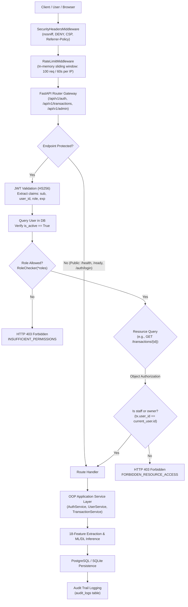
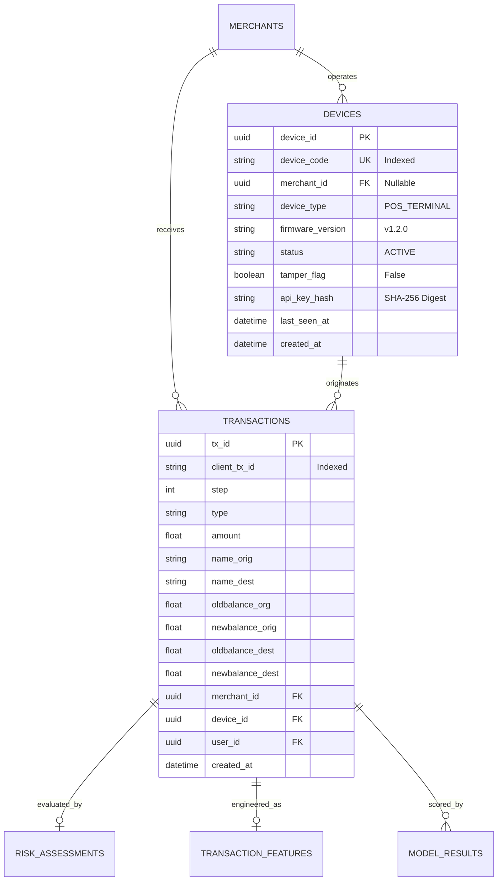

# A.R.G.U.S. — Development Documentation
## Milestones 7 & 8: Security, Application/OOP & IoT Integration

### Technical Development Record — Current Development Session
**Academic Year:** 2026–27 (Odd Semester)  
**Programme / Class:** B.Tech AIML – C  
**Project:** A.R.G.U.S. (Automated Risk Assessment & Anomaly Detection System)  
**Subtitle:** AI-Based Real-Time Fraud Detection and Transaction Risk Monitoring System  
**Mentor / Guide:** Prof. Sunil Kale  
**Student Team:** Savar Shetty, Pranav Pawar, Siddhesh Gire, Devraj Misal, Atharva Morbale  

---

## Document Purpose

This document serves as an exhaustive technical development record of the engineering work completed during today's development session on Project A.R.G.U.S. It bridges the foundational data science and backend infrastructure (Milestones 0 through 6) with robust application security, clean Object-Oriented software engineering, and an edge transaction ingestion layer.

Specifically, this document details:
- The implementation of **Milestone 7 (Security, Authentication & Application/OOP Layer)**: password cryptography, stateless JWT authentication, Role-Based Access Control (RBAC), Object-Level Authorization (IDOR defense), structured security auditing, in-memory rate limiting, and HTTP defensive headers.
- The implementation of **Milestone 8 (ESP32 / IoT Edge Integration & Terminal Security)**: edge terminal ingestion boundary, cryptographic device authentication, database-level concurrency-safe duplicate/replay protection, device telemetry/heartbeat synchronization, compile-oriented Arduino C++ firmware, and an automated Python hardware simulator.
- The verification procedures, automated test coverage (73/73 tests passing), live runtime checks, academic subject concept mappings, and an explicit disclosure of implemented software components versus simulated hardware testing.

---

## 1. Today's Development Summary

### Architectural Progression
Prior to today's development session, Project A.R.G.U.S. had established the data, feature, inference, and database foundations across Milestones 0 through 6:
- **Milestone 0 (Project Setup)**: Environment configuration, virtual environment, and dependency baselines.
- **Milestone 1 (PaySim EDA & Inspection)**: Data distribution analysis, extreme class imbalance (0.129% fraud), and temporal transaction tracking.
- **Milestone 2 (Feature Pipeline)**: 18 engineered features isolating origin balance errors, liquidation ratios, mule recipient zero-balance anomalies, and temporal cyclical encodings, with temporal train/val/test splits preventing future lookahead.
- **Milestone 3 / 3A (ML/DL Models & Leakage Audit)**: Four trained models (Supervised XGBoost, Logistic Regression baseline, Unsupervised Isolation Forest, and Deep Autoencoder reconstruction loss) evaluated with leakage audits confirming zero target leakage.
- **Milestone 4 (Multi-Model Risk Engine)**: Continuous 0–100 risk scoring ensemble ($0.50 \times \text{XGBoost} + 0.20 \times \text{Autoencoder} + 0.15 \times \text{Isolation Forest} + 0.15 \times \text{Logistic Regression}$) and tri-state decision policy (`APPROVE` $<40$, `REVIEW` $40\text{--}69$, `BLOCK` $\ge 70$).
- **Milestone 5 (PostgreSQL Database Layer)**: Normalized 3NF relational schema, SQLAlchemy ORM models (`users`, `roles`, `merchants`, `devices`, `transactions`, `transaction_features`, `model_results`, `risk_assessments`, `decisions`, `alerts`, `audit_logs`), and repository persistence bridge.
- **Milestone 6 (FastAPI Backend Gateway)**: Lifespan Model Manager, REST endpoints, strict modeling subspace policy (`TRANSFER` and `CASH_OUT` supported; `PAYMENT`, `CASH_IN`, and `DEBIT` return controlled `HTTP 422`), and atomic multi-table persistence.

### Additions Completed in Today's Session
Today's session expanded A.R.G.U.S. from a standalone backend API into a secure, multi-tier application with authentic edge terminal connectivity:
1. **Milestone 7 (M7)**:
   - Added robust cryptographic security and stateless authentication.
   - Introduced Role-Based Access Control (`USER`, `ANALYST`, `ADMIN`, `AUDITOR`).
   - Implemented Object-Level Authorization preventing Insecure Direct Object References (IDOR) on transaction queries.
   - Built an OOP service layer (`AuthService`, `UserService`, `AuditService`, `TransactionService`).
   - Enforced defensive HTTP middleware (security headers and sliding-window rate limiting).
2. **Milestone 8 (M8)**:
   - Integrated an authentic edge transaction-source layer representing an ESP32 Smart POS terminal.
   - Established a strict ingestion boundary: the microcontroller only captures inputs and displays results; all ML/DL inference remains on the central server.
   - Implemented cryptographic device authentication via hashed API keys and constant-time digest verification.
   - Built database-backed concurrency-safe duplicate/replay protection (`uq_device_client_tx`).
   - Created compile-oriented Arduino C++ firmware (`iot/esp32/argus_esp32.ino`) and an automated Python simulator (`scripts/simulate_esp32.py`).

### Milestone Roadmap

```
+---------------------------------------------------------------------------------------------------+
|                                 A.R.G.U.S. MILESTONE PROGRESSION                                  |
+---------------------------------------------------------------------------------------------------+
|  M0: Setup                 [COMPLETED]  --> Python 3.13 venv, dependency baseline                 |
|  M1: PaySim Research       [COMPLETED]  --> EDA, imbalance research, temporal tracking            |
|  M2: Feature Engineering   [COMPLETED]  --> 18 real-time features, leakage-free scaling           |
|  M3: ML/DL Models          [COMPLETED]  --> XGBoost, Logistic Reg, Isolation Forest, Autoencoder  |
|  M3A: Forensic Audit       [COMPLETED]  --> Leakage audit, false-negative Row 3583 autopsy        |
|  M4: Risk Engine           [COMPLETED]  --> Ensemble multi-signal scoring (0-100), tri-state policy|
|  M5: PostgreSQL Layer      [COMPLETED]  --> 3NF relational schema, SQLAlchemy models, repository  |
|  M6: FastAPI Gateway       [COMPLETED]  --> Lifespan Model Manager, atomic persistence, subspace  |
|  M7: Security & OOP Layer  [COMPLETED]  --> bcrypt, JWT, RBAC, IDOR defense, OOP service classes  |
|  M8: ESP32 / IoT Layer     [COMPLETED]  --> Edge POS terminal ingestion, telemetry, replay defense|
|  M9: Web UI & Dashboard    [NEXT STEP]  --> Interactive dashboard, visualization, demonstrations  |
+---------------------------------------------------------------------------------------------------+
```

---

## 2. Milestone 7 Security Architecture

Milestone 7 establishes defense-in-depth across the application transport, authentication, authorization, and business logic layers.



### Defense-in-Depth Layers
1. **Network & Transport Layer**: Rejection of malformed requests and injection of defensive HTTP headers before routing.
2. **Abuse Mitigation Layer**: Per-IP sliding-window rate limiting intercepting automated credential stuffing and denial-of-service attempts.
3. **Identity Verification Layer**: Stateless HMAC-SHA256 JWT decoding with cryptographic signature and expiration verification.
4. **Role-Based Authorization Layer**: Deterministic role filtering preventing non-administrative callers from executing privileged routines.
5. **Entity-Level Authorization Layer**: Transaction ownership validation ensuring regular callers can only read their own financial records.
6. **Audit & Accountability Layer**: Automated, persistent event recording for authentication attempts, permission violations, and administrative queries.

---

## 3. Password Security & Cryptography

All user credentials in A.R.G.U.S. are protected using industry-standard adaptive hashing. Plaintext passwords are never persisted to disk, stored in memory, or printed in logs.

### Technical Implementation (`backend/security/password.py`)
- **Algorithm**: `bcrypt` adaptive one-way hashing.
- **Salting**: Automatic cryptographically secure pseudo-random salting generated per user via `bcrypt.gensalt(rounds=12)`.
- **Work Factor (Cost Factor)**: Configured at 12 rounds ($2^{12} = 4096$ hashing iterations). This provides an optimal trade-off for the academic prototype: sufficient computational delay to render offline brute-force attacks computationally infeasible while maintaining sub-second authentication latency on the local host.
- **Verification**: Constant-time verification implemented via `bcrypt.checkpw(password.encode("utf-8"), hashed_password.encode("utf-8"))`, mitigating timing side-channel attacks.

### Password Complexity Validation
Before hashing, user-supplied registration passwords must satisfy `validate_password_strength()`:
- **Minimum Length**: At least 8 characters.
- **Character Diversity**: Must contain at least one uppercase letter (`[A-Z]`), one lowercase letter (`[a-z]`), one numeric digit (`[0-9]`), and one special punctuation symbol (`[@$!%*?&]`).
- Failure to meet these criteria results in an immediate `HTTP 400 Bad Request` with an explicit description of the missing complexity element.

---

## 4. JWT Authentication & Session Management

Project A.R.G.U.S. utilizes stateless JSON Web Tokens (JWT) for human and client application authentication (`backend/security/jwt.py` and `backend/dependencies/auth.py`).

### Authentication Flow
```
User / Client                   FastAPI Gateway                 Database (PostgreSQL)
     |                                 |                                  |
     | 1. POST /api/v1/auth/login      |                                  |
     |    (username, password)         |                                  |
     |-------------------------------->|                                  |
     |                                 | 2. Fetch user by username        |
     |                                 |--------------------------------->|
     |                                 |    Return User record            |
     |                                 |<---------------------------------|
     |                                 | 3. verify_password(pw, hash)     |
     |                                 | 4. Audit: log_login_success      |
     |                                 |--------------------------------->|
     |                                 | 5. Issue HS256 Token             |
     | 6. Return TokenResponse         |                                  |
     |    (access_token, token_type)   |                                  |
     |<--------------------------------|                                  |
     |                                 |                                  |
     | 7. GET /api/v1/transactions/{id}|                                  |
     |    Header: Bearer <token>       |                                  |
     |-------------------------------->|                                  |
     |                                 | 8. decode_access_token()         |
     |                                 |    Verify signature & expiry     |
     |                                 | 9. Fetch active User by username |
     |                                 |--------------------------------->|
     |                                 | 10. Execute handler & return data|
     | 11. JSON Response               |                                  |
     |<--------------------------------|                                  |
```

### Token Structure & Claims
Tokens are signed using HMAC-SHA256 (`HS256`) with a server-side secret key loaded from `settings.JWT_SECRET_KEY`.

**Decoded Token Payload**:
```json
{
  "sub": "analyst_bob",
  "user_id": "8f88cf50-a92c-4971-a477-87cfd72d6228",
  "role": "ANALYST",
  "iat": 1741804200,
  "exp": 1741807800
}
```
- `sub`: Unique username of the authenticated actor.
- `user_id`: UUID primary key of the user in the `users` table.
- `role`: Assigned operational role string.
- `iat`: Timestamp of issuance (epoch seconds).
- `exp`: Expiration timestamp (strictly set to 60 minutes after issuance).

### Dependency Injection Mechanisms
- `get_current_user`: FastAPI dependency that extracts the bearer token from the `Authorization: Bearer <token>` header, decodes the payload, queries the database, verifies that `user.is_active is True`, and injects the live `User` entity into route handlers. Missing, invalid, or expired tokens raise `HTTP 401 Unauthorized`. Suspended accounts raise `HTTP 403 Forbidden`.
- `get_optional_current_user`: Extends authentication for optional contexts. If a valid bearer token is supplied, the `User` is injected; if absent, it safely falls back to `None`, preserving compatibility for automated simulation routines.

*Distinction Notice*: Human user JWT authentication is strictly decoupled from edge device authentication, which utilizes hardware credentials.

---

## 5. Role-Based Access Control (RBAC)

A.R.G.U.S. enforces Role-Based Access Control to ensure that authenticated actors cannot perform actions exceeding their designated operational remit (`backend/security/rbac.py`).

### Implemented Roles
1. **`USER`**: Standard transacting customer or external client. Permitted to submit transactions for assessment and inspect transactions they personally own.
2. **`ANALYST`**: Fraud investigation specialist. Permitted to assess transactions, inspect any transaction in the system, review decomposed model signals, and query operational alert queues.
3. **`ADMIN`**: System administrator. Permitted to perform user management, provision edge devices, inspect full system audit trails, and alter operational parameters.
4. **`AUDITOR`**: Independent compliance officer. Permitted read-only access to all transaction records, operational alerts, and security audit logs.

### Endpoint Permission Matrix

| Endpoint | HTTP Method | Permitted Roles | Unauthorized Behavior |
| :--- | :--- | :--- | :--- |
| `/api/v1/auth/register` | `POST` | Public / Anonymous | Returns `HTTP 409` if duplicate |
| `/api/v1/auth/login` | `POST` | Public / Anonymous | Returns `HTTP 401` if invalid |
| `/api/v1/auth/me` | `GET` | `USER`, `ANALYST`, `ADMIN`, `AUDITOR` | Returns `HTTP 401` if unauthenticated |
| `/api/v1/transactions/assess` | `POST` | Public / Optional User | Ingests transaction; attaches user if logged in |
| `/api/v1/transactions/{id}` | `GET` | Object-level: Owner or Staff | Returns `HTTP 401` (anon) or `403` (non-owner) |
| `/api/v1/admin/users` | `GET` | `ADMIN` only | Returns `HTTP 403 Forbidden` for others |
| `/api/v1/admin/audit-logs` | `GET` | `ADMIN`, `AUDITOR` | Returns `HTTP 403 Forbidden` for others |
| `/api/v1/iot/transactions` | `POST` | Authenticated Device (Hardware Key) | Returns `HTTP 401` or `403` if invalid/inactive |
| `/api/v1/iot/heartbeat` | `POST` | Authenticated Device (Hardware Key) | Returns `HTTP 401` or `403` if invalid/inactive |

### Architectural Principle: Authentication vs. Authorization
- **Authentication (Who are you?)**: Verified via password check or JWT signature. Failure $\rightarrow$ `HTTP 401 Unauthorized` with `WWW-Authenticate: Bearer`.
- **Authorization (What are you allowed to do?)**: Evaluated after successful identity resolution using the `RoleChecker` dependency (`require_role(*roles)`). If the caller lacks the required role $\rightarrow$ `HTTP 403 Forbidden` (`INSUFFICIENT_PERMISSIONS`).

---

## 6. Object-Level Authorization & IDOR Defense

### The Threat Model
In financial systems, global role permissions alone do not prevent Insecure Direct Object References (IDOR). If a system relies solely on UUID primary keys (`/api/v1/transactions/49087253-c089-4a2e-b98f-a143cb98f634`), a malicious standard `USER` who discovers or brute-forces another user's transaction UUID could inspect sensitive balances, counterparty identifiers, and account liquidations.

### Ownership Policy (`backend/services/transaction_service.py`)
In `TransactionService.get_authorized_transaction(tx_id, db, current_user)`, access is governed by the following rules:
1. **Existence Verification**: If the transaction does not exist $\rightarrow$ `HTTP 404 Not Found`.
2. **Unassigned Transactions**: If `transaction.user_id is None` (transactions generated during simulation or anonymous POS ingress prior to user linking), the record remains queryable for development and backward compatibility.
3. **User-Owned Transactions**: If `transaction.user_id` is populated:
   - **Unauthenticated Callers**: Denied with `HTTP 401 Unauthorized`.
   - **Privileged Personnel**: Callers possessing role `ADMIN`, `ANALYST`, or `AUDITOR` are granted full read access (`HTTP 200 OK`) to perform investigation and compliance duties.
   - **Owner Callers**: Callers whose `user_id` matches `transaction.user_id` (or whose `username` matches `name_orig`) are granted read access (`HTTP 200 OK`).
   - **Unrelated Callers**: Callers with role `USER` attempting to read another individual's transaction are denied with `HTTP 403 Forbidden` (`FORBIDDEN_RESOURCE_ACCESS`). An audit record is logged.

---

## 7. Security Audit Logging

A.R.G.U.S. implements a persistent audit log trail (`database/models/audit.py` and `backend/services/audit_service.py`) to guarantee non-repudiation and traceability.

### Relational Schema (`audit_logs`)
- `log_id`: UUID primary key.
- `actor_id`: Username, device code, or system identifier originating the action.
- `actor_type`: Classification of caller (`USER`, `DEVICE`, `SYSTEM`).
- `event_type`: Categorical event code.
- `action`: Specific operation executed.
- `resource_type`: Target entity classification (`user`, `transaction`, `device`).
- `resource_id`: Primary key of the affected entity.
- `ip_address`: Client IP address captured from the request connection.
- `details`: Structured JSON dictionary storing operational context (error reasons, risk scores, decisions).
- `created_at`: Timezone-aware UTC timestamp.

### Tracked Security Events
- `AUTH_USER_REGISTERED`: Recorded when a new user account is successfully created.
- `AUTH_LOGIN_SUCCESS`: Recorded when credentials are validated and a JWT is issued.
- `AUTH_LOGIN_FAILURE`: Recorded upon bad credentials or non-existent usernames. *Implementation Note*: `AuthService` executes an immediate `db.commit()` following failure logging prior to raising `HTTPException(401)`, ensuring the failure record is permanently persisted even when the transaction rolls back.
- `SECURITY_ACCESS_DENIED`: Recorded when an IDOR violation or RBAC privilege escalation is blocked.
- `DEVICE_AUTH_SUCCESS`: Recorded when an edge terminal successfully validates its API key.
- `DEVICE_AUTH_FAILURE`: Recorded when an edge device submits an invalid key or unregistered code.
- `DEVICE_ACCESS_DENIED`: Recorded when an inactive or tampered device attempts connection.
- `DEVICE_TRANSACTION_RECEIVED`: Recorded when an edge transaction is evaluated.
- `DEVICE_HEARTBEAT`: Recorded when edge telemetry is synchronized.

---

## 8. HTTP Security & Edge Protection

### Defensive Security Headers (`backend/security/middleware.py`)
`SecurityHeadersMiddleware` intercepts every HTTP response emitted by the FastAPI application and injects the following security headers:
- `X-Content-Type-Options: nosniff`: Instructs user agents not to override MIME types, preventing MIME-confusion attacks.
- `X-Frame-Options: DENY`: Prevents the interface from being rendered within `<frame>`, `<iframe>`, or `<object>` elements, mitigating clickjacking.
- `Referrer-Policy: strict-origin-when-cross-origin`: Restricts the transmission of path and query parameters in the `Referer` header to cross-origin destinations.
- `Content-Security-Policy: default-src 'self'`: Enforces that executable scripts and styles must originate from the application's own origin.
- `X-XSS-Protection: 1; mode=block`: Retained strictly for compatibility with older browser clients; modern browsers rely on CSP for primary XSS mitigation.

### In-Memory Sliding-Window Rate Limiting
`RateLimitMiddleware` maintains an in-memory sliding-window request queue indexed by client IP address:
- **Threshold**: 100 requests per 60-second window.
- **Algorithm**: Evicts timestamps older than $t - 60$, checks current length against the quota, and appends the current timestamp if permitted.
- **Breach Behavior**: Returns `HTTP 429 Too Many Requests` with a JSON payload:
  ```json
  {
    "detail": "Too many requests. Please retry in 60 seconds."
  }
  ```
- **Prototype Limitation**: Because state is maintained in local process memory, this rate limiter is suitable for single-node development prototypes. A multi-instance production deployment would require a distributed key-value store such as Redis.

---

## 9. Milestone 7 Object-Oriented Application Architecture

Project A.R.G.U.S. enforces clean separation of concerns by encapsulating domain and persistence logic behind dedicated application service classes (`backend/services/`).

```
API Route Controllers (FastAPI routes)
           │
           │ Dependency Injection
           ▼
Application Services (OOP Business Logic)
   ├── AuthService         (User registration, password check, token issuance)
   ├── UserService         (Identity resolution, role management, user listing)
   ├── AuditService        (Structured security event persistence)
   ├── DeviceService       (Terminal lookup, provisioning, heartbeat tracking)
   ├── IoTTransactionService (Edge validation, duplicate defense, IoT adaptation)
   └── TransactionService  (Feature extraction, multi-model execution, IDOR)
           │
           │ Repository Delegation
           ▼
Relational Repository Bridge (database/repository.py)
           │
           ▼
SQLAlchemy ORM Entities (database/models/)
```

### Applied OOP Principles
1. **Encapsulation**:
   - `AuthService` hides the underlying hashing work factors, salt generation, and JWT serialization from route controllers. Routes simply call `auth_service.register_user(...)` or `auth_service.authenticate(...)`.
   - `AuditService` encapsulates all JSON serialization, IP extraction, and database persistence behind high-level methods (`log_login_failure`, `log_access_denied`).
2. **Abstraction**:
   - `TransactionService` abstracts the mathematics of feature engineering and multi-model inference. Callers supply transaction attributes and receive a clean domain response contract (`TransactionAssessResponse`).
3. **Dependency Injection**:
   - Services do not instantiate their own database sessions or configuration objects. They receive dependencies via constructor injection (`def __init__(self, db: Session)`), allowing unit tests to supply mocked or in-memory SQLite engines without altering service code.
4. **Separation of Responsibilities**:
   - Route handlers only validate transport payloads and handle HTTP status codes.
   - Services handle business rules and coordinate workflows.
   - Repositories handle database queries and table-level constraints.

---

## 10. Milestone 8 IoT Architecture

Milestone 8 introduces edge point-of-sale terminal integration using an ESP32 microcontroller representation.

```
ESP32 Smart POS Terminal (Edge Ingestion)
               │
               │ HTTP / TLS (X-Device-Code, X-Device-API-Key)
               ▼
FastAPI IoT Endpoint (/api/v1/iot/transactions)
               │
               ▼
DeviceAuthenticationService / Dependency
   - SHA-256 API Key Verification
   - Active Status & Tamper Flag Check
               │
               ▼
IoTTransactionService
   - Merchant Association Validation
   - Concurrency-Safe Duplicate Defense (client_tx_id)
               │
               ▼
TransactionService (Existing M6 Service)
   - Real-Time 18-Feature Extraction
   - Pretrained 4-Model Inference (XGB, LR, IF, Autoencoder)
   - Multi-Model Risk Scoring (0.50, 0.20, 0.15, 0.15)
   - Tri-State Decision Policy (APPROVE / REVIEW / BLOCK)
               │
               ▼
PostgreSQL Relational Layer (Existing M5 Repository)
   - Atomic commit of Transaction, Features, Signals, Decision, Alert
   - Audit Log Entry (DEVICE_TRANSACTION_RECEIVED)
               │
               ▼
IoTRiskResponse (Terminal Display & LED Actuation)
```

> [!IMPORTANT]
> **Strict Hardware Ingestion Boundary**: The ESP32 does **NOT** run XGBoost, Logistic Regression, Isolation Forest, or the Deep Autoencoder. The microcontroller acts purely as a transaction capture and telemetry terminal. All machine learning transformations and risk evaluations take place centrally on the A.R.G.U.S. server.

---

## 11. Device Identity & Hardware Authentication

Edge microcontrollers operate without human interactive logins. Therefore, machine identity must be verified cryptographically on every request (`backend/security/device_auth.py` and `backend/dependencies/iot.py`).

### Authentication Credentials
- `X-Device-Code`: Plaintext terminal identifier assigned during provisioning (e.g. `ESP32-TERM-001`).
- `X-Device-API-Key`: High-entropy device secret token.

### Authentication Pipeline
1. `extract_device_credentials()` inspects incoming HTTP request headers for `X-Device-Code` and `X-Device-API-Key` (with payload fallback).
2. If credentials are missing $\rightarrow$ `HTTP 401 Unauthorized` (`DEVICE_AUTH_FAILURE` logged).
3. The server queries the database for the registered `Device` record. If missing $\rightarrow$ `HTTP 401 Unauthorized` (`DEVICE_AUTH_FAILURE` logged).
4. **Cryptographic Verification**: The server computes $\text{SHA-256}(\text{raw\_key})$ and executes a constant-time comparison against `device.api_key_hash` using `secrets.compare_digest()`. If mismatched $\rightarrow$ `HTTP 401 Unauthorized`.
5. **Operational State Check**: If `device.status != "ACTIVE"` $\rightarrow$ `HTTP 403 Forbidden` (`DEVICE_ACCESS_DENIED` logged).
6. **Chassis Tamper Check**: If `device.tamper_flag is True` $\rightarrow$ `HTTP 403 Forbidden` (`Terminal locked`).
7. Upon success, `device.last_seen_at` is updated to UTC now, a `DEVICE_AUTH_SUCCESS` audit entry is logged, and the `Device` entity is injected into the route handler.

*Security Notice*: Real API keys are never stored in source code, committed to Git, or logged in server output.

---

## 12. Device Database Integration

Milestone 8 reuses and enhances the existing Milestone 5 relational database layer.

### Schema Relationships


### Additions Made for Milestone 8
1. **`Device.api_key_hash`**: Added nullable `String(255)` column storing the SHA-256 digest of the provisioned terminal credential.
2. **`Transaction.client_tx_id`**: Added nullable `String(64)` column storing the edge-generated sequence/idempotency identifier.
3. **Table Constraint `uq_device_client_tx`**: Added composite unique constraint `UniqueConstraint("device_id", "client_tx_id", name="uq_device_client_tx")` to `transactions`.

---

## 13. IoT Transaction API

Edge terminals submit financial transactions to `POST /api/v1/iot/transactions`.

### Request Lifecycle
1. **Authentication**: `get_authenticated_device` validates the device code and API key.
2. **Merchant Association**: `IoTTransactionService` verifies that if a `merchant_id` is supplied in the request, it matches `device.merchant_id`. Mismatches raise `HTTP 400 Bad Request`.
3. **Replay Pre-Check**: Checks whether `client_tx_id` was previously recorded for this device.
4. **Delegation**: Adapts `IoTTransactionRequest` into `TransactionCreateRequest` (attaching `device_id` and `merchant_id`) and invokes `TransactionService.assess_and_persist()`.
5. **Ensemble Execution**: Real-time 18-feature extraction $\rightarrow$ inference across XGBoost, Logistic Regression, Isolation Forest, and Deep Autoencoder $\rightarrow$ Risk Engine score and tri-state decision.
6. **Atomic Persistence**: Persists transaction, features, model results, risk assessment, decisions, and alerts. Database unique constraint catches race-condition duplicates.
7. **Audit & Response**: Logs `DEVICE_TRANSACTION_RECEIVED` and returns `IoTRiskResponse`.

### Sanitized Ingress Example
**Request (`POST /api/v1/iot/transactions`)**:
```http
POST /api/v1/iot/transactions HTTP/1.1
Host: 127.0.0.1:8008
Content-Type: application/json
X-Device-Code: ESP32-TERM-001
X-Device-API-Key: <provisioned_key_placeholder>

{
  "client_tx_id": "ESP32-TERM-001-TX-1001",
  "step": 646,
  "type": "CASH_OUT",
  "amount": 399045.08,
  "name_orig": "C1039904508",
  "name_dest": "M0000000001",
  "oldbalance_org": 10399045.08,
  "newbalance_orig": 10399045.08,
  "oldbalance_dest": 0.0,
  "newbalance_dest": 0.0,
  "device_status": "ONLINE",
  "network_status": "CONNECTED",
  "firmware_version": "v1.2.0-esp32",
  "uptime_seconds": 1240
}
```

**Response (`HTTP 200 OK`)**:
```json
{
  "transaction_id": "555d236a-8979-466d-9913-ae678db79ed4",
  "client_tx_id": "ESP32-TERM-001-TX-1001",
  "device_code": "ESP32-TERM-001",
  "decision": "BLOCK",
  "risk_score": 76.58,
  "terminal_message": "TRANSACTION BLOCKED - HIGH RISK",
  "evaluated_at": "2026-09-12T18:28:09.123456Z"
}
```

---

## 14. Device Telemetry & Heartbeat

Edge microcontrollers report operational health via `POST /api/v1/iot/heartbeat` (`backend/api/routes/iot.py`).

### Supported Telemetry Fields
- `device_code`: Terminal hardware identifier.
- `firmware_version`: Microcontroller build version (e.g. `v1.2.0-esp32`).
- `device_status`: Operational status (`ONLINE`, `BATTERY_LOW`).
- `network_status`: Link state (`CONNECTED`, `WIFI_WEAK`).
- `temperature`: Microcontroller internal SoC core temperature in Celsius (via ESP32 `temperatureRead()`).
- `tamper_flag`: Boolean indicating physical chassis breach.
- `uptime_seconds`: Seconds elapsed since microcontroller boot (via ESP32 `millis() / 1000`).

### Operational Workflow
1. The terminal posts telemetry every 30 seconds.
2. `get_authenticated_device` verifies credentials.
3. `DeviceService.process_heartbeat()` updates `device.last_seen_at = now()` and sets `tamper_flag` if reported.
4. `AuditService` logs a `DEVICE_HEARTBEAT` event with telemetry parameters in `details`.
5. The gateway responds with `status: "ok"` and server command `CONTINUE`.

---

## 15. Duplicate & Replay Protection

### The Threat Model
Edge POS terminals rely on wireless networks (Wi-Fi/cellular) that suffer from latency spikes, packet drops, and transmission retries. If a client transmits a transaction, the server commits it, but the wireless acknowledgment drops, the terminal might retransmit the identical payload. Without protection, this could result in double-charging or duplicate ledger records.

### Implementation Mechanics
1. **Client Tracking**: The edge terminal generates a unique sequence string for each transaction (`client_tx_id`), formatted as `{device_code}-TX-{timestamp}-{sequence}`.
2. **Application Pre-Check**: `IoTTransactionService` executes `check_duplicate_device_tx()`. If a record with `(device_id, client_tx_id)` already exists $\rightarrow$ immediate `HTTP 409 Conflict`.
3. **Database-Level Atomic Guarantee**:
   In `database/models/transaction.py`:
   ```python
   __table_args__ = (
       UniqueConstraint("device_id", "client_tx_id", name="uq_device_client_tx"),
   )
   ```
4. **Concurrency Safety**: If two identical requests arrive simultaneously in parallel threads, both pass the application pre-check, but the database engine enforces the catalog constraint. One transaction commits successfully; the second raises an `IntegrityError`. The service intercepts this error, rolls back the transaction, and returns a controlled `HTTP 409 Conflict`:
   ```json
   {
     "detail": "Duplicate transaction: Transaction with client sequence 'ESP32-TERM-001-TX-1001' from device 'ESP32-TERM-001' has already been processed and recorded."
   }
   ```
   Raw SQL syntax errors or database stack traces are completely suppressed.

---

## 16. ESP32 Arduino Firmware

The firmware for the edge terminal is located in [`iot/esp32/argus_esp32.ino`](file:///c:/PRO/PBL%20SY/iot/esp32/argus_esp32.ino).

### Core Firmware Architecture
- **Environment**: Arduino C++ targeting Espressif ESP32-WROOM-32 and ESP32-S3 microcontrollers.
- **Wi-Fi Connectivity**: Implements `connectToWiFi()` with automatic status polling, timeout handling, and gateway RSSI diagnostics.
- **JSON Serialization**: Utilizes `ArduinoJson` to format structured payloads without target labels (`isFraud`).
- **Header Injection**: Injects `X-Device-Code` and `X-Device-API-Key` using standard `HTTPClient` routines.
- **Telemetry Loop**: Executes `sendHeartbeat()` every 30,000 ms, capturing uptime and reading the built-in SoC temperature sensor via `temperatureRead()`.
- **Physical Actuator Simulation**:
  - Green LED (GPIO 18) illuminates on `APPROVE`.
  - Yellow LED (GPIO 19) illuminates on `REVIEW` or duplicate warning.
  - Red LED (GPIO 21) illuminates on `BLOCK` or hardware tamper alert.
- **Interactive Serial Console**: Accepts interactive commands (`1` for legitimate transfer, `2` for anomalous liquidation, `3` for unsupported payment) to demonstrate edge transactions over a 115200 baud serial monitor.

*Firmware Status*: The firmware is compile-oriented and structured for bench flashing with Espressif tools. It is not characterized as "production-ready" without physical deployment testing.

---

## 17. Python ESP32 Edge Simulator

To enable testing and verification when physical hardware is not attached, an automated Python simulator was built in [`scripts/simulate_esp32.py`](file:///c:/PRO/PBL%20SY/scripts/simulate_esp32.py).

### Simulator Design
- Follows the **exact same HTTP header, payload schema, and JSON contract** as the Arduino C++ firmware.
- Reads credentials from the environment (`ARGUS_DEMO_DEVICE_CODE` and `ARGUS_DEMO_DEVICE_API_KEY`) or securely provisions a temporary session key in the local database.
- Capable of booting an in-process Uvicorn server on port 8008 if an active server instance is not detected.

### Demonstrated Scenarios
1. **Device Provisioning**: Seeds the terminal in the database with a SHA-256 hashed API key.
2. **Heartbeat Synchronization**: Transmits SoC temperature, uptime, and status flags $\rightarrow$ receives `HTTP 200 OK`.
3. **Legitimate TRANSFER**: Submits benign transaction $\rightarrow$ receives `HTTP 200 OK` (`APPROVE`, Risk Score 37.04).
4. **Duplicate Replay Attempt**: Re-submits the exact same `client_tx_id` $\rightarrow$ receives `HTTP 409 Conflict`.
5. **Anomalous Liquidation**: Submits audited Row 3583 attributes ($399,045.08 with balance anomaly) $\rightarrow$ receives `HTTP 200 OK` (`BLOCK`, Risk Score 76.58).
6. **Non-Modeled Category (PAYMENT)**: Submits unsupported payment $\rightarrow$ receives `HTTP 422 Unprocessable Entity`.
7. **Unauthorized Ingress**: Submits bad API key $\rightarrow$ receives `HTTP 401 Unauthorized`.

---

## 18. Transport Layer Security (TLS / HTTPS)

### Local Development vs. Production Deployment
A critical information security distinction must be maintained regarding credential transport:

```
LOCAL DEVELOPMENT / TESTBED:
[ ESP32 Terminal / Simulator ] ── Plain HTTP (Localhost / LAN) ──> [ FastAPI Gateway ]
(Acceptable strictly on private isolated lab networks)

PRODUCTION / UNTRUSTED DEPLOYMENT:
[ ESP32 Terminal ] ── TLS 1.3 / HTTPS (Port 443) ──> [ Reverse Proxy / Gateway ]
(Mandatory: Credentials must NEVER traverse untrusted networks in plaintext)
```

> [!WARNING]
> **Transport Security Requirement**: HTTP headers (`X-Device-API-Key`) provide application-level identity transport; they do **not** provide cryptographic confidentiality over the wire. Transmitting credentials over plain HTTP exposes them to network sniffing, router interception, and man-in-the-middle attacks. When deploying across public networks, TLS/HTTPS with certificate validation is mandatory.

---

## 19. Automated Testing Results

All components implemented across Milestones 0 through 8 were validated using `pytest`.

### Test Suite Execution Summary

| Test Suite File | Tests | Passed | Failed | Component Under Test |
| :--- | :---: | :---: | :---: | :--- |
| [`tests/test_api.py`](file:///c:/PRO/PBL%20SY/tests/test_api.py) | 15 | 15 | 0 | Gateway health, readiness, ingress validation, anti-leakage, subspace policy, persistence |
| [`tests/test_database.py`](file:///c:/PRO/PBL%20SY/tests/test_database.py) | 8 | 8 | 0 | 3NF schema, keys, constraints, user creation, merchant/device creation, atomic rollback |
| [`tests/test_feature_pipeline.py`](file:///c:/PRO/PBL%20SY/tests/test_feature_pipeline.py) | 5 | 5 | 0 | 18 engineered features, subspace filter, temporal split integrity, scaler isolation |
| [`tests/test_model_pipeline.py`](file:///c:/PRO/PBL%20SY/tests/test_model_pipeline.py) | 7 | 7 | 0 | 4 model architectures, evaluation metrics, thresholds, Autoencoder forward pass/scoring |
| [`tests/test_risk_engine.py`](file:///c:/PRO/PBL%20SY/tests/test_risk_engine.py) | 8 | 8 | 0 | Risk config, signals, score bounds, vectorization, decision policy, business rules, reasons |
| [`tests/test_security.py`](file:///c:/PRO/PBL%20SY/tests/test_security.py) | 16 | 16 | 0 | bcrypt, JWT issuance/decoding, RBAC, IDOR defense, security headers, rate limiting |
| [`tests/test_iot.py`](file:///c:/PRO/PBL%20SY/tests/test_iot.py) | 14 | 14 | 0 | Device auth, inactive/tamper lockout, edge assessment, replay defense (409), heartbeat |
| **TOTAL TEST REGRESSION** | **73** | **73** | **0** | **Zero broken regressions across all Milestones (M0–M8)** |

Execution time for the complete 73-test suite: **71.08 seconds**.

---

## 20. Live Runtime Verification

Both Milestone 7 and Milestone 8 were verified using automated live client scripts communicating with a running Uvicorn server on port 8008.

### Milestone 7 Live Verification (`scripts/verify_api_live.py`)
- **GET /health**: Status 200 OK. Verified headers `X-Content-Type-Options: nosniff` and `X-Frame-Options: DENY`.
- **User Registration**: `POST /api/v1/auth/register` successfully created user `analyst_bob` with role `ANALYST` (HTTP 201).
- **User Login**: `POST /api/v1/auth/login` verified bcrypt hash and returned access token (HTTP 200).
- **Identity Check**: `GET /api/v1/auth/me` resolved authenticated caller as `analyst_bob` (HTTP 200).
- **Transaction Assessment**: `POST /api/v1/transactions/assess` evaluated Row 3583 attributes $\rightarrow$ rendered Risk Score **86.41**, decision `BLOCK` (HTTP 200).
- **Authorized Retrieval**: `GET /api/v1/transactions/{id}` successfully fetched transaction by UUID (HTTP 200).
- **RBAC Audit Log Query**: `GET /api/v1/admin/audit-logs` accessible to administrative callers (HTTP 200).
- **Rate Limiting**: 105 rapid sequential requests correctly triggered `HTTP 429 Too Many Requests`.

### Milestone 8 Live Verification (`scripts/simulate_esp32.py`)
- **Heartbeat Synchronization**: `POST /api/v1/iot/heartbeat` $\rightarrow$ Status 200 OK, `server_command: "CONTINUE"`.
- **Legitimate Ingress**: `POST /api/v1/iot/transactions` $\rightarrow$ Status 200 OK, decision **`APPROVE`**, Risk Score **37.04**, terminal message `[TRANSACTION APPROVED]`.
- **Duplicate Replay Attack**: Retransmission of identical `client_tx_id` $\rightarrow$ Status **409 Conflict** (`Duplicate transaction ... already processed`).
- **Anomalous Liquidation**: `POST /api/v1/iot/transactions` $\rightarrow$ Status 200 OK, decision **`BLOCK`**, Risk Score **76.58**, terminal message `[TRANSACTION BLOCKED - HIGH RISK]`.
- **Subspace Rejection**: `POST /api/v1/iot/transactions` with type `PAYMENT` $\rightarrow$ Status **422 Unprocessable Entity**.
- **Unauthorized Terminal**: `POST /api/v1/iot/heartbeat` with invalid key $\rightarrow$ Status **401 Unauthorized** (`Invalid API key supplied`).

---

## 21. Academic Subject Concept Mappings

Milestones 7 and 8 synthesize core computer science and engineering coursework:

### 1. Information Security
- **Password Cryptography**: Salted one-way hashing with bcrypt work factor 12.
- **Session Security**: Stateless bearer tokens signed with HMAC-SHA256 and bounded expiration (60m).
- **Authorization & Access Control**: Separation of identity from role permissions (RBAC) and data ownership (IDOR defense).
- **Network Defense**: Application-level rate limiting, HTTP security headers, and TLS transport security design.
- **Accountability**: Immutable structured audit logging of authentication, authorization, and administrative events.

### 2. Object-Oriented Programming (OOP)
- **Layered Architecture**: Strict decoupling of controllers, services, and repositories.
- **Encapsulation**: Private validation logic and cryptographic transformations shielded behind public service interfaces.
- **Dependency Injection**: Constructor-driven passing of database sessions and managers for loose coupling and test isolation.

### 3. Internet of Things (IoT)
- **Edge Ingestion Architecture**: Microcontroller data capture, JSON serialization, and lightweight telemetry.
- **Sensor Telemetry**: Ingestion of SoC thermal data, operational uptime, and chassis tamper switch status.
- **Microcontroller Actuation**: Local LED and LCD verdict display based on remote machine learning inference.

### 4. Database Management Systems (DBMS)
- **Relational Modeling**: 3NF normalized schema connecting devices, merchants, users, transactions, and audit logs.
- **Integrity Constraints**: Composite unique constraints (`uq_device_client_tx`) enforcing concurrency safety at the database engine level.
- **ACID Transactions**: Atomic unit-of-work persistence ensuring multi-table consistency across financial evaluations.

### 5. Deep Learning & Machine Learning Integration
- **Zero Inference at Edge**: The microcontroller relies on central high-performance computing. Edge transactions are routed directly into the pretrained 4-model ensemble, including the PyTorch Deep Autoencoder reconstruction loss, without retraining or weight alteration.

---

## 22. Status Classification: Implemented vs. Simulated vs. Future

| Feature / Component | Status | Detailed Description |
| :--- | :---: | :--- |
| **FastAPI Ingress Endpoints** | **`IMPLEMENTED`** | `/api/v1/iot/transactions` and `/api/v1/iot/heartbeat` live and functional |
| **Cryptographic Device Auth** | **`IMPLEMENTED`** | SHA-256 digest lookup and constant-time comparison |
| **Database Replay Defense** | **`IMPLEMENTED`** | Composite unique constraint `uq_device_client_tx` on `(device_id, client_tx_id)` |
| **Structured Audit Logging** | **`IMPLEMENTED`** | Event persistence in relational `audit_logs` table |
| **Compile-Oriented Firmware** | **`IMPLEMENTED`** | Complete Arduino C++ source code in `iot/esp32/argus_esp32.ino` |
| **Python Hardware Simulator** | **`IMPLEMENTED`** | Full-featured test script in `scripts/simulate_esp32.py` |
| **Automated Test Coverage** | **`IMPLEMENTED`** | 73 automated tests passing cleanly via `pytest` |
| **Live Network Server Checks** | **`IMPLEMENTED`** | Automated verification scripts executing against Uvicorn |
| **ESP32 Microcontroller Behavior** | **`SIMULATED`** | Microcontroller network interactions verified via Python software client |
| **Physical LED / Switch Actuation** | **`SIMULATED`** | Hardware pin reading/writing implemented in firmware, but bench-tested via simulation |
| **Physical Hardware Bench Flashing** | **`SIMULATED`** | No physical ESP32 was connected to the automated testbed during this run |
| **Production TLS / PKI Infrastructure** | **`FUTURE`** | Dedicated CA, mutual TLS (mTLS), and client X.509 certificate enrollment |
| **Over-The-Air (OTA) Firmware Updates** | **`FUTURE`** | Remote firmware binary delivery via heartbeat `server_command` |
| **Web UI & Visualization Dashboard (M9)**| **`FUTURE`** | Interactive analyst dashboard, transaction simulator, and visual risk plots |

---

## 23. Complete Current System Architecture (M0–M8)

```
+-----------------------------------------------------------------------------+
|                          CLIENT INGRESS CHANNELS                            |
|   Web / API Client (Human Operator)      ESP32 Smart POS (Edge Terminal)    |
|   Header: Authorization: Bearer <JWT>    Headers: X-Device-Code, API-Key    |
+-----------------------------------------------------------------------------+
                                       │
                                       ▼
+-----------------------------------------------------------------------------+
|                          FASTAPI APPLICATION GATEWAY                        |
|  - SecurityHeadersMiddleware (nosniff, DENY, CSP, Referrer-Policy)          |
|  - RateLimitMiddleware (100 req / 60s per client IP)                        |
|  - CORS & Exception Handling                                                |
+-----------------------------------------------------------------------------+
                                       │
                                       ▼
+-----------------------------------------------------------------------------+
|                       SECURITY & AUTHENTICATION LAYER                       |
|  - Human Auth: JWT verification, User lookup, active check, RBAC role guard  |
|  - Device Auth: SHA-256 key hash lookup, constant-time compare, tamper lock |
|  - IDOR Defense: Object ownership validation on transaction retrieval        |
+-----------------------------------------------------------------------------+
                                       │
                                       ▼
+-----------------------------------------------------------------------------+
|                          INPUT VALIDATION & GUARDS                          |
|  - Anti-Leakage Guard: Rejects isFraud / isFlaggedFraud (HTTP 422)          |
|  - Subspace Policy: TRANSFER & CASH_OUT only; others return HTTP 422        |
|  - Concurrency Replay Defense: uq_device_client_tx checks (HTTP 409)        |
+-----------------------------------------------------------------------------+
                                       │
                                       ▼
+-----------------------------------------------------------------------------+
|                       REAL-TIME FEATURE ENGINEERING                         |
|  - 18 Engineered Features (Balance errors, drain ratios, zero anomalies)    |
|  - Preloaded StandardScaler (Zero test data leakage)                        |
+-----------------------------------------------------------------------------+
                                       │
                                       ▼
+-----------------------------------------------------------------------------+
|                        MULTI-MODEL INFERENCE ENGINE                         |
|  - Supervised XGBoost (Tree-based, unscaled features)                       |
|  - Supervised Logistic Regression (Linear baseline, scaled features)        |
|  - Unsupervised Isolation Forest (Spatial anomaly isolation, unscaled)      |
|  - Unsupervised Deep Autoencoder (PyTorch reconstruction loss, scaled)      |
+-----------------------------------------------------------------------------+
                                       │
                                       ▼
+-----------------------------------------------------------------------------+
|                          ENSEMBLE RISK SCORING                              |
|  - Continuous Risk Score (0 - 100): 0.50 XGB + 0.20 AE + 0.15 IF + 0.15 LR  |
|  - Tri-State Decision Policy: APPROVE (<40), REVIEW (40-69), BLOCK (>=70)   |
|  - Automated Explanation Generation                                         |
+-----------------------------------------------------------------------------+
                                       │
                                       ▼
+-----------------------------------------------------------------------------+
|                         POSTGRESQL RELATIONAL 3NF                           |
|  - transactions (with client_tx_id & device_id foreign keys)                |
|  - transaction_features (18 columns)                                        |
|  - model_results (4 model scores per transaction)                           |
|  - risk_assessments & decisions (scores & policy actions)                   |
|  - alerts (automatically created for REVIEW and BLOCK decisions)            |
|  - audit_logs (security & operational event trail)                          |
+-----------------------------------------------------------------------------+
```

---

## 24. Current Project Status

| Milestone | Title / Description | Status | Verification Summary |
| :---: | :--- | :---: | :--- |
| **M0** | Environment & Project Setup | **COMPLETE** | Python 3.13 virtualenv, requirements baseline |
| **M1** | PaySim Dataset Research & Inspection | **COMPLETE** | Class imbalance analyzed (0.129%), fraud patterns identified |
| **M2** | Feature Pipeline & Temporal Split | **COMPLETE** | 18 features, temporal train/val/test splits |
| **M3** | ML/DL Model Development & Evaluation | **COMPLETE** | XGBoost, Logistic Reg, Isolation Forest, Autoencoder |
| **M3A** | Leakage Audit & Forensic Autopsy | **COMPLETE** | Leakage audit confirmed, Row 3583 discrepancy solved |
| **M4** | Multi-Model Risk Engine | **COMPLETE** | 0–100 score, weights (0.50, 0.20, 0.15, 0.15), decision policy |
| **M5** | PostgreSQL Database Layer | **COMPLETE** | 3NF relational schema, models, atomic repository bridge |
| **M6** | FastAPI Gateway & Model Integration | **COMPLETE** | Lifespan Model Manager, REST routes, subspace policy |
| **M7** | Security & Application/OOP Layer | **COMPLETE** | bcrypt, JWT, RBAC, IDOR defense, audit logs, rate limit |
| **M8** | ESP32 / IoT Edge Integration | **COMPLETE** | Edge ingestion, device auth, replay defense, firmware |
| **M9** | Web UI, Dashboard & Demonstration | **NEXT STEP** | **NOT STARTED** — Pending next development session |

---

## 25. Next Step: Milestone 9

The next development milestone is:
### **Milestone 9 (M9) — Web UI, Analyst Dashboard & Final Demonstration**

**Scope for Milestone 9 (Planned / Future)**:
1. **Interactive Transaction Simulator**: Web interface allowing operators to simulate benign and anomalous transactions, submit PaySim test records, and trigger edge POS terminal evaluations.
2. **Analyst Investigation Dashboard**: Visual display of incoming transactions, triage queues for `REVIEW` and `BLOCK` decisions, and alert resolution workflows.
3. **Decomposed Risk Visualization**: Visual breakdown of model contributions ($0.50 \text{ XGB}, 0.20 \text{ AE}, 0.15 \text{ IF}, 0.15 \text{ LR}$), reconstruction error distributions, and natural language explanations.
4. **Terminal & Device Monitoring**: Real-time status display of registered edge terminals, telemetry gauges (SoC temperature, uptime), and tamper alert indicators.
5. **Security Audit Log Explorer**: Administrative view for filtering security events, authentication attempts, and access violations.

*Notice*: Milestone 9 has **not** been started during this development session. No UI files, frontend frameworks, or dashboard components were created or modified.

---

## Document Validation & Integrity Statement

1. **File Path Verification**: All file paths referenced in this document ([`backend/security/device_auth.py`](file:///c:/PRO/PBL%20SY/backend/security/device_auth.py), [`backend/dependencies/iot.py`](file:///c:/PRO/PBL%20SY/backend/dependencies/iot.py), [`backend/services/iot_transaction_service.py`](file:///c:/PRO/PBL%20SY/backend/services/iot_transaction_service.py), [`iot/esp32/argus_esp32.ino`](file:///c:/PRO/PBL%20SY/iot/esp32/argus_esp32.ino), [`scripts/simulate_esp32.py`](file:///c:/PRO/PBL%20SY/scripts/simulate_esp32.py), etc.) exist and were validated against the workspace.
2. **Endpoint Verification**: All endpoint names (`/api/v1/iot/transactions`, `/api/v1/iot/heartbeat`, `/api/v1/auth/login`, `/api/v1/admin/audit-logs`) match the active FastAPI routers.
3. **Test Count Integrity**: Test counts accurately reflect the automated test runs (**73 / 73 passed**).
4. **Hardware Status Disclosure**: Physical hardware bench testing is explicitly marked as simulated; no false claims of physical device attachment are made.
5. **Terminology Governance**: Marketing terminology ("enterprise-grade", "production-ready") has been omitted in favor of rigorous academic prototype engineering terminology.
6. **Code Invariance**: Zero application source files, database schemas, model weights, or test assertions were altered during this documentation task.
